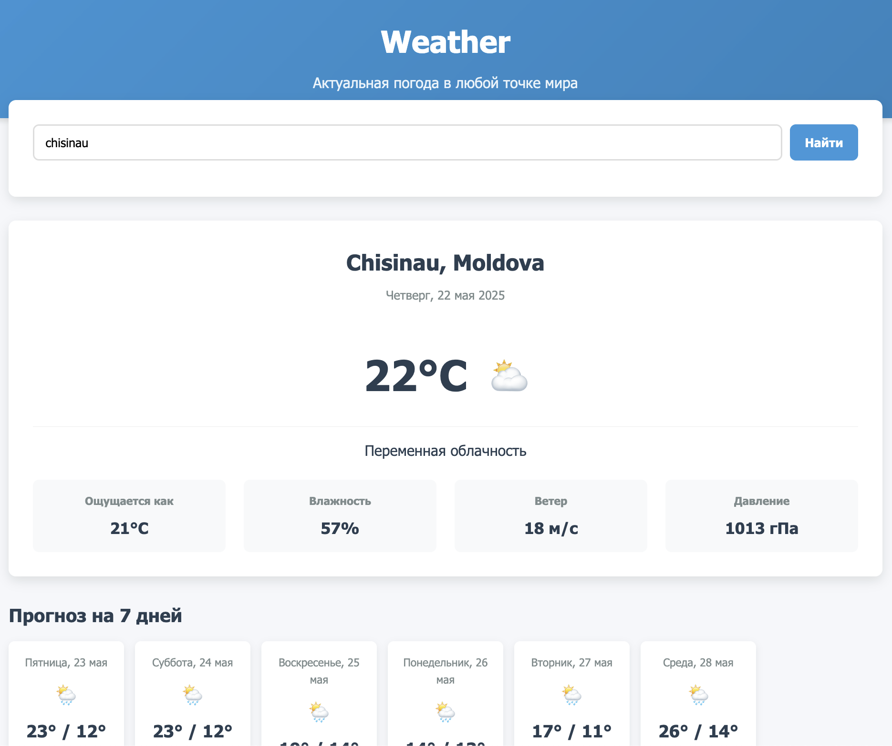
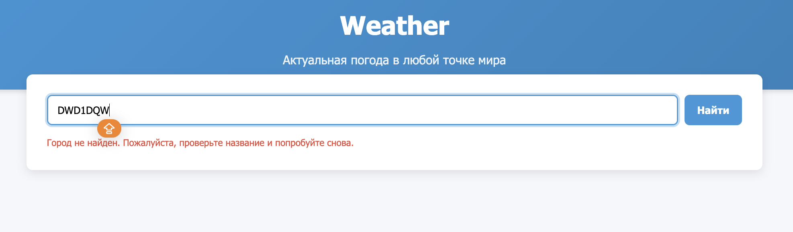

# Отчет по проекту WeatherNow

## Описание проекта
Weather - это веб-приложение для просмотра текущей погоды и прогноза на 7 дней вперед. Приложение использует Open-Meteo API для получения актуальных метеорологических данных.

## Функциональность
- Поиск погоды по названию города
- Отображение текущей погоды с деталями (температура, влажность, ветер, давление)
- Прогноз погоды на 7 дней
- Сохранение последнего запрошенного города в localStorage
- Адаптивный интерфейс
    

## Технологии
- Vanilla JavaScript
- HTML5
- CSS3
- Open-Meteo API

## Ключевые элементы кода

### Инициализация приложения
```javascript
function initApp() {
    searchButton.addEventListener('click', searchWeather);
    cityInput.addEventListener('keypress', function(e) {
        if (e.key === 'Enter') {
            searchWeather();
        }
    });

    const lastCity = localStorage.getItem('lastCity');
    if (lastCity) {
        cityInput.value = lastCity;
        searchWeather();
    }
}
```

### Получение координат города
```javascript
async function getCoordinates(cityName) {
    try {
        const response = await fetch(`${GEO_API_URL}?name=${encodeURIComponent(cityName)}&count=1`);
        const data = await response.json();

        if (!data.results || data.results.length === 0) {
            throw new Error('Город не найден');
        }

        return {
            latitude: data.results[0].latitude,
            longitude: data.results[0].longitude,
            name: data.results[0].name,
            country: data.results[0].country
        };
    } catch (error) {
        throw error;
    }
}
```

### Получение данных о погоде
```javascript
async function getWeatherData(latitude, longitude) {
    try {
        const url = `${API_BASE_URL}?latitude=${latitude}&longitude=${longitude}&current=temperature_2m,relative_humidity_2m,apparent_temperature,precipitation,weather_code,pressure_msl,wind_speed_10m&daily=weather_code,temperature_2m_max,temperature_2m_min,precipitation_sum&timezone=auto`;

        const response = await fetch(url);
        const data = await response.json();

        return data;
    } catch (error) {
        throw error;
    }
}
```

### Обновление интерфейса с прогнозом погоды
```javascript
function updateForecastUI(dailyData) {
    forecastContainer.innerHTML = '';

    for (let i = 0; i < dailyData.time.length; i++) {
        if (i === 0) continue;

        const date = new Date(dailyData.time[i]);
        const maxTemp = Math.round(dailyData.temperature_2m_max[i]);
        const minTemp = Math.round(dailyData.temperature_2m_min[i]);
        const weatherCode = dailyData.weather_code[i];
        const precipitation = dailyData.precipitation_sum[i];

        const forecastCard = document.createElement('div');
        forecastCard.className = 'forecast-card';

        const weekday = weekdays[date.getDay()];
        const day = date.getDate();
        const month = months[date.getMonth()];

        forecastCard.innerHTML = `
            <div class="forecast-date">${weekday}, ${day} ${month}</div>
            <div class="forecast-icon">${weatherIcons[weatherCode] || '🌈'}</div>
            <div class="forecast-temp">${maxTemp}° / ${minTemp}°</div>
            <div class="forecast-desc">${weatherDescriptions[weatherCode] || 'Неизвестно'}</div>
            <div class="forecast-precip">${precipitation > 0 ? `Осадки: ${precipitation} мм` : 'Без осадков'}</div>
        `;

        forecastContainer.appendChild(forecastCard);
    }
}
```

## Структура HTML
Приложение имеет следующую структуру:
- Шапка с названием
- Поле поиска города
- Блок текущей погоды
- Блок прогноза на 7 дней
- Индикатор загрузки
- Сообщение об ошибке

## Особенности реализации
- Использование асинхронных запросов к API
- Локализация дат и описаний погоды на русский язык
- Система иконок для разных погодных условий
- Обработка ошибок при поиске города
- Сохранение последнего запроса в localStorage

## Возможные улучшения
1. Добавление карты с отображением местоположения
2. Реализация выбора единиц измерения (C/F)
3. Добавление более детальной информации о ветре (направление)
4. Реализация адаптивного дизайна для мобильных устройств
5. Добавление анимаций при загрузке данных

Проект представляет собой законченное решение для получения актуальной информации о погоде с простым и интуитивно понятным интерфейсом.