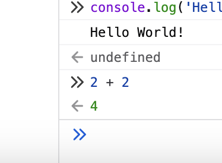
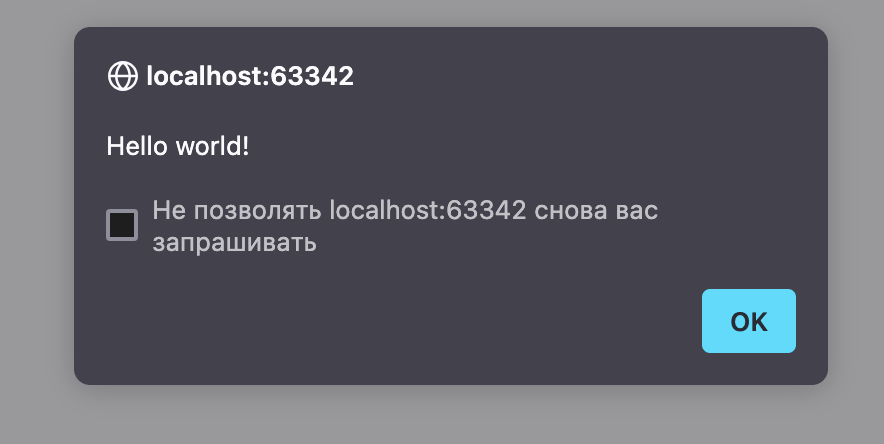
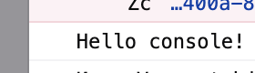
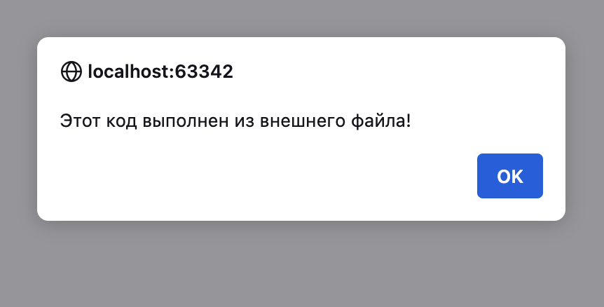
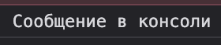
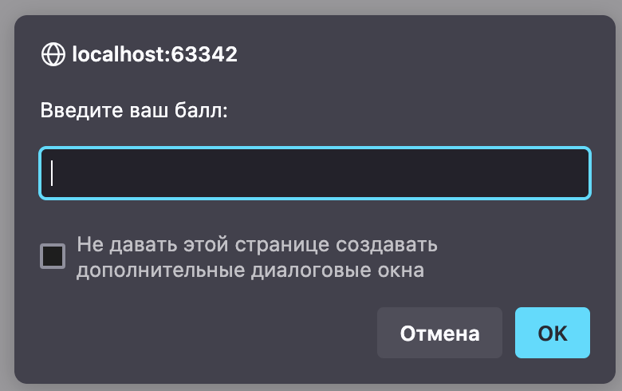
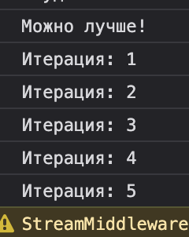

# Инструкции по запуску проекта

## Требования и запуск
- Среда разработки (IDE), поддерживающая файлы форматов `.js`, `.html`, `.md`.
Например: WebStorm, Visual Studio Code и др.
- Импорт проекта или копирование кода из `README`

# Описание лабораторной работы
Данная работа знакомит с базовым синтаксисом JavaScript.

---

## Подключение скрипта в HTML
- Если скрипт подключён в `<head>`, он загрузится до появления содержимого `<body>` и будет иметь доступ только к объектам, объявленным ранее в `<head>`
- Для работы с элементами `<body>` скрипт нужно подключать в конце файла

---

# Выполнение кода JavaScript в браузере

## Использование консоли разработчика
Код JavaScript можно писать и запускать в консоли разработчика (кнопка `F12`).

### Вывод "Hello, World!" в консоли:


### Вычисление суммы в консоли:


---

# Создание HTML-страницы с JavaScript

Создан файл `index.html` с кодом:
```html
<!DOCTYPE html>
<html lang="en">
<head>
   <meta charset="UTF-8">
   <meta name="viewport" content="width=device-width, initial-scale=1.0">
   <title>Привет, мир!</title>
</head>
<body>
<script>
   alert("Hello world!");
   console.log("Hello console!");
</script>
</body>
</html>
```

Этот код выводит:
1. Окно с сообщением:

2. Сообщение в консоли:

---

# Подключение внешнего JavaScript-файла

Создан файл `script.js`:
```javascript
alert("Этот код выполнен из внешнего файла!");
console.log("Сообщение в консоли");
```

Подключение в `index.html`:
```html
<script src="scripts/script.js"></script>
```

Проверка работы:




---

# Работа с типами данных

### Объявление переменных и их вывод в консоль
В `script.js`:
```javascript
let name = "Voronetchii Stanislav";
let birthYeard = 2005;
let isStudent = true;

console.log("Имя:", name);
console.log("Год рождения", birthYeard);
console.log("Студент:", isStudent);
```
Все переменные автоматически получают свои типы.


---

# Управление потоком выполнения (условия и циклы)

В `script.js`:
```javascript
let score = prompt("Введите ваш балл:");
if (score >= 90) {
 console.log("Отлично!");
} else if (score >= 70) {
 console.log("Хорошо");
} else {
 console.log("Можно лучше!");
}

for (let i = 1; i <= 5; i++) {
 console.log(`Итерация: ${i}`);
}
```

Запрос к пользователю:


Вывод в консоль:

---

# Контрольные вопросы

1. **Чем отличаются `var`, `let` и `const`?**
    - `var` позволяет использовать переменную за пределами блока и позволяет объявлять переменные с одинаковыми именами, что может привести к ошибкам.
    - `let` ограничивает область видимости блока и не допускает повторного объявления.
    - `const` создаёт константу, значение которой нельзя изменить после инициализации.

2. **Что такое неявное преобразование типов?**
    - Это автоматическое приведение одного типа данных к другому, например при сложении числа и строки (`5 + "3"` становится `"53"`).

3. **Разница между `==` и `===`?**
    - `==` выполняет сравнение с приведением типов (`5 == "5"` → `true`).
    - `===` сравнивает и тип, и значение (`5 === "5"` → `false`).

---

# Источники

1. [Современный учебник JavaScript](https://learn.javascript.ru)
2. [Преобразование типов](https://habr.com/ru/companies/ruvds/articles/347866/)

