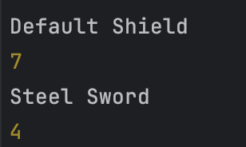

# Лабораторная работа №3

## Цель работы

Познакомиться с классами и объектами в JavaScript, научиться создавать классы, использовать конструкторы и методы, а также реализовать наследование.

## Условие

Создайте консольное приложение, моделирующее систему инвентаря, где можно добавлять предметы, изменять их свойства и управлять ими.

## Создание класса Item:
Класс Item будет содержать общие поля для всех объектов, принадлежащих предметам
```javascript
let validRarities = ["common", "uncommon", "rare", "legendary"];

/**
 * Class representing an item with a name, weight, and rarity.
 * Create a new Item.
 * @param {string} _name - The name of the item.
 * @param {number} _weight - The weight of the item.
 * @param {string} _rarity - The rarity level of the item (must be one of: "common", "uncommon", "rare", "legendary").
 * @throws Will throw an error if the rarity is invalid.
 */
class Item {
    constructor(_name, _weight, _rarity) {
        this.#name = _name;
        this.weight = _weight;
        if (!validRarities.includes(_rarity)) {
            throw new Error(`Invalid Rarity: ${_rarity}`);
        }
        this.rarity = _rarity;
    }
    // Private field for name
    #name;
    // Public properties
    weight;
    rarity;

    /**
     * Gets the item's name.
     * @returns {string} The name of the item.
     */
    getInfo() {
        return this.#name;
    }

    /**
     * Sets a new weight for the item.
     * @param {number} newWeight - The new weight to assign to the item.
     */
    setWeight(newWeight) {
        this.weight = newWeight;
    }
}
```

## Создание класс Weapon
Класс Weapon будет наследником класса Item.
Помимо его полей, будет так же иметь поля Damage и Durability.
```javascript
class Weapon extends Item {
    /**
     * Create a new Weapon.
     * @param {string} _name - The name of the weapon.
     * @param {number} _weight - The weight of the weapon.
     * @param {string} _rarity - The rarity of the weapon (must be valid).
     * @param {number} _damage - The amount of damage the weapon deals (must be >= 0).
     * @param {number} _durability - The durability of the weapon (must be >= 0).
     * @throws Will throw an error if damage or durability is negative.
     */
    constructor(_name, _weight, _rarity, _damage, _durability) {
        super(_name, _weight, _rarity);

        if (_damage < 0) {
            throw new Error(`Invalid Damage: ${_damage}`);
        }
        this.damage = _damage;

        if (_durability < 0) {
            throw new Error(`Invalid Durability: ${_durability}`);
        }
        this.durability = _durability;
    }

    // Public properties
    damage;
    durability;

    use() {
        if (this.durability > 0) {
            this.durability -= 10;
        } else {
            console.log("Weapon is broken");
        }
    }

    repair() {
        this.durability = 100;
    }
}
```
## Тесты приложения
### Проверка методов класса Item:
```javascript
const shield = new Item("Default Shield", 5, "uncommon");
shield.setWeight(7);
console.log(shield.getInfo());
console.log(shield.weight);

const sword = new Item("Steel Sword", 5, "rare"); // Исправлено: удалена лишняя запятая
console.log(sword.getInfo());
sword.setWeight(4.0);
console.log(sword.weight);
```
Консоль:



### Проверка методов класса Weapon
```javascript
const bow = new Weapon("Longbow", 2.0, "uncommon", 15, 100);
console.log(bow.getInfo());
bow.use();
console.log(bow?.durability);
console.log(bow?.somemethod);
bow.repair();
```
Консоль:

Undefined мы получили вместо сообщения об ошибке,
при вызове несуществующего метода,
т.к. обращались к нему через опциональную цепочку.

## Вариант кода с использованием функций-конструкторов
```javascript
let validRarities = ["common", "uncommon", "rare", "legendary"]

/**
 * Class representing an item with a name, weight, and rarity.
 * Create a new Item.
 * @param {string} _name - The name of the item.
 * @param {number} _weight - The weight of the item.
 * @param {string} _rarity - The rarity level of the item (must be one of: "common", "uncommon", "rare", "legendary").
 * @throws Will throw an error if the rarity is invalid.
 */
class Item {
    constructor(_name, _weight, _rarity) {
        this.name = _name;
        this.weight = _weight;
        if (!validRarities.includes(_rarity)) {
            throw new Error(`Invalid Rarity: ${_rarity}`);
        }
        this.rarity = _rarity;

    }
    #name;
    weight;
    rarity;

    /**
     * Gets the item's name.
     * @returns {string} The name of the item.
     */
    getInfo() {
        return this.name;
    }
    /**
     * Sets a new weight for the item.
     * @param {number} newWeight - The new weight to assign to the item.
     */
    setWeight(newWeight) {
        this.weight = newWeight;
    }
}


class Weapon extends Item {
    /**
     * Create a new Weapon.
     * @param {string} _name - The name of the weapon.
     * @param {number} _weight - The weight of the weapon.
     * @param {string} _rarity - The rarity of the weapon (must be valid).
     * @param {number} _damage - The amount of damage the weapon deals (must be >= 0).
     * @param {number} _durability - The durability of the weapon (must be >= 0).
     * @throws Will throw an error if damage or durability is negative.
     */
    constructor(_name, _weight, _rarity, _damage, _durability) {
        super(_name, _weight, _rarity);
        if (_damage < 0) {
            throw new Error(`Invalid Damage: ${_damage}`);
        } else {
            this.damage = _damage;
        }
        if (_durability < 0) {
            throw new Error(`Invalid Durability: ${_durability}`);
        } else {
            this.durability = _durability;
        }
    }

    damage;
    durability;

    use() {
        if (this.durability > 0) {
            this.durability -= 10;
        }
        else {
            console.log("Weapon is broken");
        }
    }
    repair() {
        this.durability = 100;
    }
}
```

## Ответы на контрольные вопросы
1. Какое значение имеет this в методах класса?
   В методах класса this ссылается на текущий экземпляр класса.
2. Как работает модификатор доступа # в JavaScript?
   Символ # делает свойство или метод приватным
   — доступ к нему возможен только внутри класса,
   в котором оно объявлено. Вне класса обращаться к такому свойству нельзя.
3. В чем разница между классами и функциями-конструкторами?
   Классы - более удобная и современная форма.
   Функции-конструкторы не поддерживают приватные поля,
   и каждый метод нужно добавлять вручную при помощи prototype.